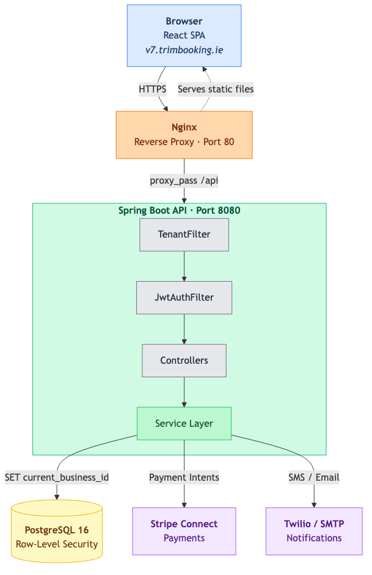

# TRiM - A Multi Tenant SaaS Application

**Final Year Project**: BSc (Hons) Computing in Software Development  
**Student:** Ariel Nunes (G00418763) | **Supervisor:** Andrew Beatty  
**College:** ATU Galway | **Year:** 2025/2026

---

## Overview

TRiM is a multi-tenant, business management tool/booking platform for barbershops. Customers can browse services, book appointments, and pay deposits online. Barbers manage their own schedules, availability, and breaks. Admins oversee services, staff, customers, and business analytics through a dashboard.

The platform is designed as a **SaaS product**: multiple barbershops operate on a single deployment, each isolated by subdomain (e.g. `v7.trimbooking.ie`, `topcuts.trimbooking.ie`). Tenant data is secured using PostgreSQL with **Row-Level Security (RLS)**.

---

## Features

| Role | Capabilities |
|------|-------------|
| **Customer** | Browse services by category, book appointments with a barber, pay deposits online or in-shop, view and cancel bookings |
| **Barber** | View upcoming schedule, set weekly availability and breaks, mark appointments as completed or no-show |
| **Admin** | Manage services and categories, manage barbers, calendar overview, customer management (blacklisting), analytics dashboard |

**Highlights:**
- Real-time slot availability computed from barber schedules and existing bookings
- Stripe integration for online deposit payments to reduce no-shows
- Email (Gmail SMTP) and SMS (Twilio) booking confirmations and reminders
- Subdomain-based multi-tenancy with Row-Level Security
- Swagger/OpenAPI documentation

---

## Getting Started

A live instance is deployed at **business-1.trimbooking.ie** (each barbershop is served from its own subdomain of `trimbooking.ie`).

To run the project locally:

1. **Start PostgreSQL** (the backend setup assumes port `5433`; a Docker image is the easiest path).
2. **Run the backend** Spring Boot API on port `8080`: follow [`backend/README.md`](backend/README.md) for environment variables, database setup, and profiles (`default`, `rls`, `seed`, `test`).
3. **Run the frontend** Vite dev server on port `3000`: follow [`frontend/README.md`](frontend/README.md) for environment variables and available scripts.

---

## Tech Stack

| Layer | Technologies |
|-------|-------------|
| **Backend** | Java 21, Spring Boot 3.5, Spring Security, Spring Data JPA, PostgreSQL |
| **Auth** | JWT, role-based access (Customer / Barber / Admin) |
| **Payments** | Stripe (server + client) |
| **Notifications** | Spring Mail (Gmail SMTP), Twilio SMS |
| **Frontend** | React 19, TypeScript 5.9, Vite 7 |
| **State & Routing** | Redux Toolkit, React Router 7 |
| **Styling** | Tailwind CSS 3.4 |
| **Testing** | JUnit (unit/integration), Gatling (load testing) |
| **API Docs** | SpringDoc OpenAPI (Swagger UI) |

---

## Architecture



Requests from the React SPA hit Nginx, which serves the static frontend bundle and reverse-proxies `/api` calls to the Spring Boot backend on port 8080. Inside the API, the `TenantFilter` resolves the `X-Business-Slug` header (derived from the subdomain) to a `business_id` and stores it in `TenantContext`; the `JwtAuthFilter` then validates the bearer token before the request reaches a controller. The service layer adds `SET LOCAL app.current_business_id` on each transaction so PostgreSQL Row-Level Security policies scope every query to the current tenant. Payments are handled through Stripe Connect, and booking confirmations and reminders are dispatched via Twilio (SMS) and Gmail SMTP (email).

---

## Repository Structure

```
booking-system-fyp/
├── backend/
│   └── trim-booking-api/        # Spring Boot REST API
│       ├── src/main/java/       #   Application source code
│       ├── src/main/resources/  #   Configuration & properties
│       ├── src/test/            #   Unit, integration & Gatling tests
│       ├── scripts/             #   RLS setup SQL scripts
│       └── pom.xml
├── frontend/                    # React SPA
│   ├── src/
│   │   ├── api/                 #   Axios client & endpoint functions
│   │   ├── components/          #   UI components (admin, barber, booking, shared)
│   │   ├── pages/               #   Page-level components
│   │   ├── store/               #   Redux store & slices
│   │   ├── routes/              #   Application routing
│   │   ├── hooks/               #   Custom React hooks
│   │   ├── types/               #   TypeScript type definitions
│   │   └── utils/               #   Utility functions
│   ├── package.json
│   └── vite.config.ts
└── Documentation/               # Dissertation PDF, screencast & screenshots
    ├── Screenshots/             #   UI screenshots used in this README
    ├── architecture.png         #   System architecture diagram
    └── TRiM-Screencast.mov      #   Application demo video
```

---

## Spring Profiles

| Profile | Purpose |
|---------|---------|
| *(default)* | Standard development mode: Hibernate `ddl-auto=update`, direct DB access |
| `rls` | Enables Row-Level Security: uses a restricted PostgreSQL user, disables DDL auto-update |
| `seed` | Generates large-scale test data (configurable businesses, customers, bookings) via `DataSeeder` |
| `test` | Used by automated tests: H2 in-memory database, dummy service credentials |

---

## Screenshots

### Public / Onboarding

| Login & sign-up | Register a new business |
|-----------------|-------------------------|
|  |  |

### Customer

| Home | Booking confirmation step | My Bookings |
|------|---------------------------|-------------|
|  |  |  |

### Barber

| Weekly working hours | Breaks |
|----------------------|--------|
|  |  |

### Admin

| Analytics dashboard | Shop calendar |
|---------------------|---------------|
|  |  |

| Services management (dark mode) | Customers List |
|---------------------------------|--------------------------|
|  |  |

### Email Notification


